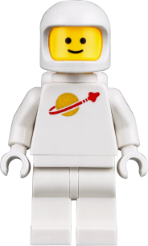

<!-- PROJECT LOGO -->
<br />
<div align="center"> 
  <div>
    <a href="https://github.com/ignasiusadhitia/weekend_from_home">    
      
    </a>
  </div>
  
    
  <h3 align="center">WKND From Home</h3>

  <p align="center">
    A company responsive landing page.
    <br />
    <a href="https://github.com/ignasiusadhitia/weekend_from_home"><strong>Explore the docs »</strong></a>
    <br />
    <br />
    <a href="https://ignasiusadhitia.github.io/weekend_from_home">View Live Demo</a>
    ·
    <a href="https://github.com/ignasiusadhitia/weekend_from_home/issues">Report Bug</a>
    ·
    <a href="https://github.com/ignasiusadhitia/weekend_from_home/issues">Request Feature</a>
  </p>
</div>


<!-- TABLE OF CONTENTS -->
<details>
  <summary>Table of Contents</summary>
  <ol>
    <li>
      <a href="#about-the-project">About The Project</a>
      <ul>
        <li><a href="#built-with">Built With</a></li>
      </ul>
    </li>
    <li>
      <a href="#getting-started">Getting Started</a>
      <ul>
        <li><a href="#prerequisites">Prerequisites</a></li>
        <li><a href="#installation">Installation</a></li>
      </ul>
    </li>    
    <li><a href="#project-files-structure">Project Files Structure</a></li>  
    <li><a href="#project-links">Project Links</a></li>
    <li><a href="#contact">Contact</a></li>   
    <li><a href="#acknowledgments">Acknowledgments</a></li>       
  </ol>
</details>


<!-- ABOUT THE PROJECT -->
## About The Project

[![wknd from_home ][product-screenshot]](https://ignasiusadhitia.github.io/weekend_from_home)

WKND from home is a company website which has a complete design and is fully responsive (mobile first). There are several features on the page such as:

- **Loading Screen**: A loading screen is displayed when the page is loading.
- **Header**: A fixed header with a logo and a user name.
- **Hero**: A hero section with a background image, a text and an animated CTA button.
- **Carousel**: A swipeable carousel with a list of clients testimonial cards with a hover effect.
- **Posts**: A list of posts with a featured image, a title and a link to the post button with a hover effect.
- **Customized Scrollbar**: A customized scrollbar with a custom scrollbar color.


  
<p align="right">(<a href="#top">back to top</a>)</p>


### Built With

This Simple Slider project was built with [React.js](https://reactjs.org/) and [SCSS](https://sass-lang.com/).

<p align="right">(<a href="#top">back to top</a>)</p>


<!-- GETTING STARTED -->
## Getting Started

### Prerequisites

Please make sure you have the latest version of [Node Package Manager (NPM)](https://www.npmjs.com/) on your system.
* npm
  ```sh
  npm install npm@latest -g
  ```

### Installation

_This is how to run the project on your local environment._

1. Clone the repo
   ```sh
   git clone https://github.com/ignasiusadhitia/weekend_from_home.git
   ```
2. Open the repo directory
   ```sh
   cd weekend_from_home
   ```
3. Install NPM packages
   ```sh
   npm install
   ```
4. Run the project
   ```js
   npm start
   ```
5. Your browser will open automatically or you can open it manually and enter this address:
   ```js
   http://localhost:3000/
   ```
   
<p align="right">(<a href="#top">back to top</a>)</p>


<!-- PROJECT FILES STRUCTURE -->
## Project Files Structure

```js
src/
┣ assets/
┃ ┣ images/
┃ ┃ ┣ arrow-active.svg
┃ ┃ ┣ arrow-inactive.svg
┃ ┃ ┣ astronout-1.svg
┃ ┃ ┣ astronout-2.svg
┃ ┃ ┣ astronout-3.svg
┃ ┃ ┣ avatar.svg
┃ ┃ ┣ BG_1.svg
┃ ┃ ┣ help-and-tips-image.jpg
┃ ┃ ┣ oval.svg
┃ ┃ ┣ screenshot.png
┃ ┃ ┣ very-light-red-path-1.svg
┃ ┃ ┣ very-light-red-path-2.svg
┃ ┃ ┣ very-light-red-path-3.svg
┃ ┃ ┗ very-light-red-path-4.svg
┃ ┗ scss/
┃   ┣ default.scss
┃   ┗ variables.scss
┣ components/
┃ ┣ carousel-item/
┃ ┃ ┣ carousel-item.component.jsx
┃ ┃ ┗ carousel-item.styles.scss
┃ ┣ custom-button/
┃ ┃ ┣ custom-button.component.jsx
┃ ┃ ┗ custom-button.styles.scss
┃ ┣ error-item/
┃ ┃ ┣ error-item.component.jsx
┃ ┃ ┗ error-item.styles.scss
┃ ┣ help-and-tips-item/
┃ ┃ ┣ help-and-tips-item.component.jsx
┃ ┃ ┗ help-and-tips-item.styles.scss
┃ ┗ paragraph-item/
┃   ┣ paragraph-item.component.jsx
┃   ┗ paragraph-item.styles.scss
┣ layouts/
┃ ┣ carousel-section/
┃ ┃ ┣ carousel-section.component.jsx
┃ ┃ ┗ carousel-section.styles.scss
┃ ┣ footer/
┃ ┃ ┣ footer.component.jsx
┃ ┃ ┗ footer.styles.scss
┃ ┣ header/
┃ ┃ ┣ header.component.jsx
┃ ┃ ┗ header.styles.scss
┃ ┣ help-and-tips-section/
┃ ┃ ┣ help-and-tips-section.component.jsx
┃ ┃ ┗ help-and-tips-section.styles.scss
┃ ┣ hero-section/
┃ ┃ ┣ hero-section.component.jsx
┃ ┃ ┗ hero-section.styles.scss
┃ ┣ pov-and-resource-section/
┃ ┃ ┣ pov-and-resource-section.component.jsx
┃ ┃ ┗ pov-and-resource-section.styles.scss
┃ ┣ testimonial-section/
┃ ┃ ┣ testimonial-section.component.jsx
┃ ┃ ┗ testimonial-section.styles.scss
┃ ┗ you-are-all-set-section/
┃   ┣ you-are-all-set-section.component.jsx
┃   ┗ you-are-all-set-section.styles.scss
┣ pages/
┃ ┣ homepage/
┃ ┃ ┣ homepage.component.jsx
┃ ┃ ┗ homepage.styles.scss
┃ ┗ loading-page/
┃   ┣ loading-page.component.jsx
┃   ┗ loading-page.styles.scss
┣ services/
┃ ┣ getHelpAndTips.js
┃ ┗ getTestimonials.js
┣ App.js
┣ App.test.js
┣ index.js
┣ reportWebVitals.js
┗ setupTests.js

```

<p align="right">(<a href="#top">back to top</a>)</p>


<!-- PROJECT LINKS -->
## Project Links

Project Link: [https://github.com/ignasiusadhitia/weekend_from_home](https://github.com/ignasiusadhitia/weekend_from_home)

Project Live Demo: [https://ignasiusadhitia.github.io/weekend_from_home](https://ignasiusadhitia.github.io/weekend_from_home)

<p align="right">(<a href="#top">back to top</a>)</p>


<!-- CONTACT -->
## Contact

Ignasius Yuda Adhitia - [Github](https://github.com/ignasiusadhitia/) - [Gitlab](https://gitlab.com/ignasiusadhitia/) - [LinkedIn](https://www.linkedin.com/in/ignasiusadhitia/) - [Email](hi@ignasiusadhitia.com) - [Website](www.ignasiusadhitia.com)

<p align="right">(<a href="#top">back to top</a>)</p>


<!-- ACKNOWLEDGMENTS -->
## Acknowledgments

* [How to Make a Simple React Carousel](https://dev.to/rakumairu/simple-react-carousel-24m0)
* [CSS Button With Hover Effect](https://codepen.io/avvign/pen/NVJzQW)
* [Glasmorphism Generator](https://hype4.academy/tools/glassmorphism-generator)

<p align="right">(<a href="#top">back to top</a>)</p>


<!-- MARKDOWN LINKS & IMAGES -->
[product-screenshot]: src/assets/images/screenshot.png


